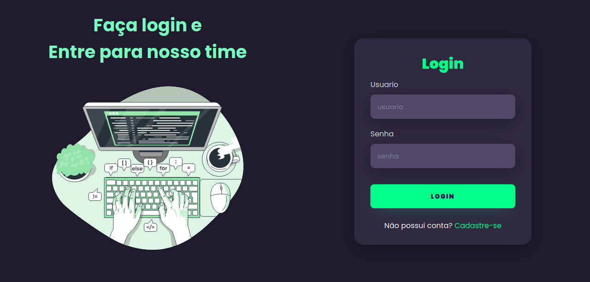

<h1 align="center"> tela de login </h1>

  <a href="#-tecnologias">Tecnologias</a>&nbsp;&nbsp;&nbsp;|&nbsp;&nbsp;&nbsp;
  <a href="#-projeto">Projeto</a>&nbsp;&nbsp;&nbsp;|&nbsp;&nbsp;&nbsp;
  <a href="#memo-licença">Licença</a>

  

 

<h1>Desktop:</h2>
  
  
<h1>Mobile:</h2>
  

## 🚀 Tecnologias

Esse projeto foi desenvolvido com as seguintes tecnologias:

- HTML e CSS
- JavaScript

## 💻 Projeto

Projeto desenvolvido com o objetivo de criar uma tela de login para o usuário acessar determinada plataforma e também aplicando validação garantindo que os dados solicitados nos campos sejam preenhidos e também aplicando a responsividade na página.

## :memo: Licença

Esse projeto está sob a licença MIT.

---
